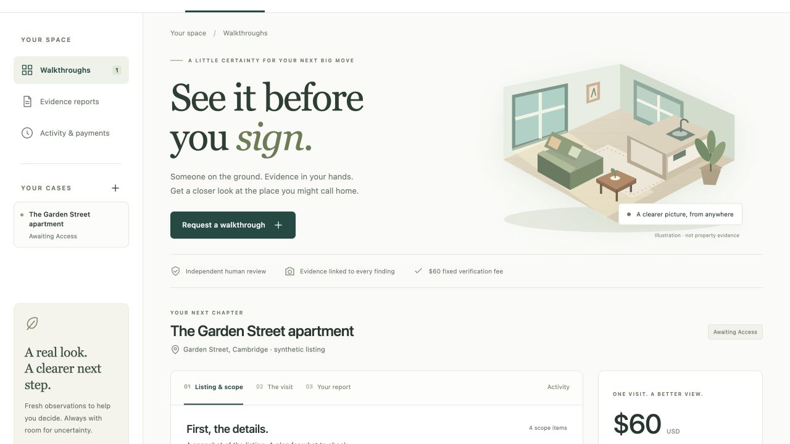

# Browser verification

Verified October 3, 2026 against the local production build.

- Renter accepted the fixed scope and authorized the simulated $60 fee; the appointment became locked.
- Verifier started a session and submitted four staged images linked to scope items and a fresh challenge. The kitchen finding was unfavorable.
- Independent completion published the report. An injected capture timeout preserved an unknown payment and the $40 earning obligation.
- Reconciliation confirmed the capture without another charge.
- Renter appeal held the earning; operator resolution and a demo clock advance made it eligible without claiming payout completion.
- Operator reset restored the synthetic listing and corrected bathroom citation.
- Desktop, 375 px phone, and 812 px landscape layouts inspected. A decorative illustration overflow was fixed and the phone layout rechecked with no horizontal page overflow. No browser console errors observed during the tested journey.

This is manual browser verification with synthetic evidence, not a claim of real PayPal transactions, property authenticity, model accuracy, or complete accessibility certification.

