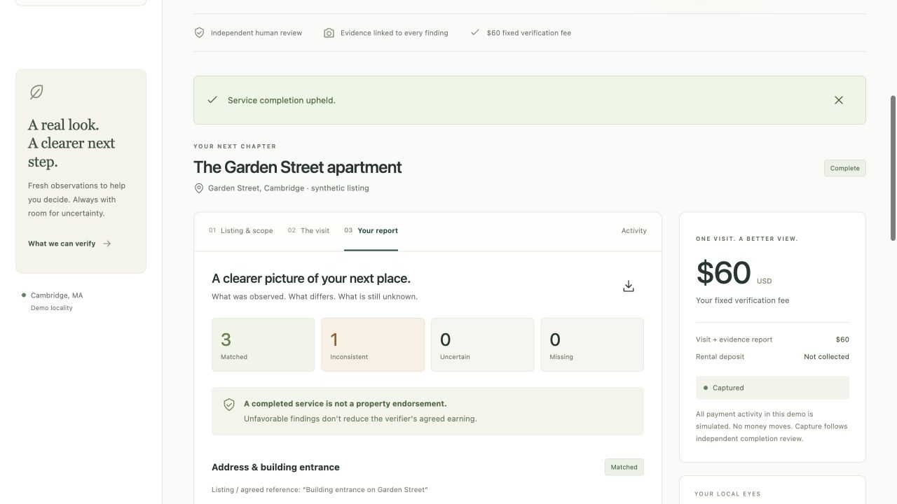

# Walkthrough — independent product, design, and demo judge

Pinned commit: `521a0f4ff8c0760e4d0bdcbd18c86302505979ec`. Frozen source: `/private/tmp/paypal-judge-20261003/walkthrough`. Review date: October 3, 2026, America/New_York. This is a simulated assessment under the supplied five equally weighted criteria, not an official result or prize prediction.

**Overall: 63/100.** A visually coherent local prototype with a particularly good distinction between property findings, service completion, and money movement. The experience actually connects renter, verifier, reviewer, and appeal workflows. Its main limitations are incomplete reviewer-to-verifier feedback, small operational text, synthetic evidence that cannot establish inspection usefulness, and unverified PayPal/model execution.

## Method and limitations

I read the supplied rubric and only this assigned frozen repository. I used the UI/UX Pro Max and in-app Browser skills, including the skill's targeted web validation/error guidance. I inspected React UI, responsive CSS, checklist generation, financial adapter, domain transitions, README setup/demo instructions, and license. Source references below are repository-relative with verified line numbers. The compact source often places whole components on one line; line references therefore identify the relevant implementation, not an artificially precise smaller span.

I independently operated `http://127.0.0.1:3203` through the in-app browser at its default 1280×720 viewport and a 375×812 override. Only this isolated synthetic state was changed. I restored the viewport afterward. No live provider/model call, original application mutation, external posting, source edit, or sibling comparison was performed. I did not run tests/build as this persona; technology scoring is based on source inspection and the independently observed UI workflow, not claimed test results. Dependencies are reused from the source installation rather than a clean installation. I did not use historical browser QA as proof of present behavior.

Verified flows:

1. Seeded renter listing → confirm access and fixed scope → simulated $60 authorization → scheduled appointment.
2. Switch to Maya → start session → add one staged image → submit a deliberately partial package.
3. Switch to Jordan → enter review notes and confirm review → approval remained disabled with three missing items → request more evidence → return to Maya. Typed review feedback was absent from the verifier view.
4. Add remaining three staged samples → submit → inspect four findings, including inconsistent kitchen → open the linked kitchen image successfully.
5. Complete independent review with simulated capture-response loss → observe service complete / payment unknown / earning pending → reconcile → one displayed capture operation confirmed.
6. Return to renter → inspect completed report → open service appeal → operator sees earning held → uphold with resolution → service complete / captured / earning pending. No payout claimed.

Not independently exercised: real uploads, downloaded JSON contents, sandbox approval/webhooks/refund/void, live checklist generation, expiry, payout eligibility, keyboard/screen-reader end-to-end operation, assistive-technology conformance, or a real visit. A successful synthetic state transition does not establish any of these.

## Scores

| Criterion | Score /10 | Rationale in brief |
|---|---:|---|
| Technological Implementation | 6.5 | Substantial working local state flow and honest payment recovery; provider and model behavior unverified. |
| Design | 7.0 | Cohesive, complete role journey and clear uncertainty; handoff feedback and readability need work. |
| Potential Impact | 6.0 | Specific remote-renter need, plausible evidence service; usefulness and operating economics not demonstrated with real participants. |
| Innovation / Idea | 6.5 | Thoughtful incentive design and bounded findings; distinction is primarily workflow, without demonstrated model advantage. |
| Presentation | 5.5 | Strong visual identity and reproducible demo narrative; no recorded public end-to-end video or provider proof. |
| **Equally weighted total** | **63 /100** | **2 × (6.5 + 7 + 6 + 6.5 + 5.5)** |

**Technological Implementation — 6.5.** The observed application is considerably more than a static design. Scope acceptance, authorization, role handoffs, partial-coverage review, adverse completion, response-loss reconciliation, and appeal state all worked in my browser session. Source separates operations and records idempotent operation identities before dispatch (`server/payments.mjs:14–33`), implements sandbox authorize/capture/void/refund (`server/payments.mjs:25–30`), and grounds optional structured AI checklist claims in exact listing text (`server/ai.mjs:17–22`). These are meaningful implemented mechanisms. However, the running experience explicitly used deterministic rules and simulated payment records; source adapters do not prove successful provider integration. Image assessment is verifier observation plus coverage (`server/ai.mjs:24`), and the payout is an obligation record rather than a completed transfer. Those honest boundaries cap the integration score without erasing the working prototype's depth.

**Design — 7.0.** The calm green palette, consistent iconography, illustration, typography hierarchy, repeated fixed fee, and four case sections form a recognizable product. Source citations sit beside checklist claims, evidence links sit beside findings, and uncertain payment state is actionable. The mobile page stayed within its 375px viewport; report counts and ledger cards reflowed without horizontal overflow in the tested views. The main design weakness is the operational handoff: reviewer notes typed before returning evidence disappear, while the verifier sees only a generic return notification. A second weakness is readability: computed mobile session instruction text was 9px and capture instructions 10px; desktop detail text is similarly compressed. The promotional header also occupies most of the initial desktop screen and remains present for workers. This is a coherent journey, with incomplete support for repeated field work rather than a broken core demo.

**Potential Impact — 6.0.** The audience and decision are specific: a remote renter deciding whether to proceed with an apartment. A fixed-scope visit that exposes an absent dishwasher can be useful, and paying for complete work regardless of a favorable result reduces one obvious incentive to gloss over concerns. The product sensibly refuses to turn observations into a safety, ownership, or fraud guarantee (`src/main.jsx:32–34`, `62`). But I saw no consented real inspection, renter/verifier feedback, outcome measure, or cost evidence. The staged kitchen image is a generic room illustration, so it demonstrates linkage and labeling rather than a usable appliance inspection. Two operational demo windows and an illustrative $60/$40 split do not yet show an available, affordable service. Impact remains a credible hypothesis supported by a working service workflow, not established benefit.

**Innovation / Idea — 6.5.** The most distinctive mechanism in this artifact is its treatment of incentives and uncertainty: fixed evidence scope, session-linked submissions, independent completion review, payment even for adverse findings, and separate capture/earning/appeal states. My failure-path test made that concrete. I do not claim market novelty; no competitor research was conducted. The AI component is presently optional checklist drafting, while the core assessment is human-based. That is a sensible product boundary but leaves the AI-specific differentiator modest. To improve this score, demonstrate a nontrivial listing/question set where grounded model drafting leads to a better actual visit than the baseline checklist, with a small failure analysis.

**Presentation — 5.5.** “See it before you sign” communicates the user and decision quickly. The visual design, synthetic labels, honest limitations, runnable README, and adverse-findings narrative make the product easy to understand. The README provides a concrete three-minute demo sequence (`README.md:35–44`). That is a script, not a recorded demo: the supplied context says no public video exists, and `README.md:127` says none was produced. The actual sequence also involves long scrolling, repeated role switching, and generic generated room images. Those are manageable in a tightly edited video, but the current materials do not show a compelling real evidence result or actual PayPal/model execution. I credit the clear product story and documentation without substituting them for missing presentation evidence.

## Evidence register

| Label | Type | Evidence and interpretation |
|---|---|---|
| D1 | Observed screenshot | `design-desktop.jpg`: default 1280×720 landing/workspace; attractive hierarchy but first case tabs only reach the bottom of the viewport. |
| D2 | Observed screenshot + DOM | `design-mobile-visit.jpg`: 375×812 verifier view; no root horizontal overflow (`scrollWidth = innerWidth = 375`). Session instruction 9px, task instructions 10px, source/status text 9px by computed style. |
| D3 | Observed workflow | After one staged entrance image, review showed 1 matched / 3 missing. Completing notes and checkbox still left approval disabled. Return succeeded, but the detailed note was not displayed to the verifier. |
| D4 | Observed screenshot + workflow | `design-mobile-unknown.jpg`: service Complete, payment Unknown, earning Pending; reconciliation restored Captured with one displayed capture operation. |
| D5 | Observed screenshots + workflow | `design-mobile-report.jpg`, `design-final-report.jpg`: final report shows 3 matched / 1 inconsistent / 0 uncertain / 0 missing; report disclaimer persists. Appeal held the earning and uphold restored pending. |
| S1 | Source | `src/main.jsx:42–46`: acceptance, checkout, rescheduling, cancellation. `server/domain.mjs:26–38`: fixed-scope and authorization transitions. |
| S2 | Source | `src/main.jsx:49–56`: session coverage, staged sample, consented upload, submission. `src/main.jsx:63`: return action sends an empty object despite available review-note text. `server/domain.mjs:55–56`: return stores no correction reason. |
| S3 | Source | `src/styles.css:1`, `5–6`: small text values, mobile breakpoints; `src/styles.css:7`: reduced-motion handling. `src/main.jsx:22–27`: skip link, persistent hero, labeled tabs/status regions. |
| S4 | Source | `server/ai.mjs:7–15`: rules checklist ignores renter questions, uses generic tasks and first matching sentence. `src/main.jsx:41–42`: no manual checklist editing before frozen acceptance. |
| S5 | Source | `src/main.jsx:58–68`: reports, JSON export, appeal, financial ledger. `server/domain.mjs:51–53`, `64–75`, `93`: review, appeal, earning and capture behavior. |
| S6 | Source / declared boundary | `README.md:68`, `91–103`, `113`, `123–127`: unexercised sandbox/model, human evidence comparison, disabled payouts, release/submission gaps. `LICENSE:1–8`: MIT license. |

## Strengths to preserve

- **Payment for the work, not for a favorable answer.** This is both legible product copy and a working observed transition. Preserve the adverse kitchen example and the independent-completion boundary.
- **Separate service, payment, and earning state.** The unknown-capture screen is understandable, recoverable, and avoids calling an earning paid. This is an unusually valuable demo moment.
- **Evidence provenance and limits beside the result.** Listing references, timestamped session-linked items, synthetic labels, and per-finding links help the viewer assess what a statement actually means.
- **A consistent visual system across roles and widths.** The native forms, visible status text, restrained icon use, and single-column mobile evidence layout provide a strong base.
- **Explicit caveats that align with the implementation.** The product does not claim visual AI verification, proof of location, safe tenancy, or sent payouts. Keep this precision when shortening the pitch.

## Prioritized improvements

No P0 found in the tested core demo. Priorities below are calibrated for a credible hackathon iteration, not enterprise readiness.

1. **P1 — Preserve correction requests when returning a package.** Observed D3; source S2. Reproduce: submit one sample, switch to operator, type detailed independent-review notes, click Request more evidence, then switch to verifier. Only the generic return message survives. Send and persist a `returnReason` (or dedicated correction field), identify affected checklist items, and render the latest request above the verifier's capture tasks. This closes the actual human-review loop. Acceptance check: a verifier can explain exactly what to recapture without speaking to the operator outside the app.

2. **P1 — Produce one provider-backed end-to-end demonstration with a short video.** Evidence S6 and supplied submission context. Exercise actual sandbox authorization and capture/void in a separate safe environment and one live checklist-generation call; preserve labeled failures and recorded provider outcomes. Then record a public video under three minutes showing the problem, one meaningful discrepancy, review, and payment state. Do not relabel the existing synthetic flow as provider proof. This addresses the largest technology/theme and presentation evidence gap.

3. **P1 — Make task instructions and financial states readable at phone size.** Observed D2/D4 and S3. At 375px, capture instructions are 10px and challenge instructions 9px; report/ledger labels are also small. Raise core instructional copy to roughly 14–16px, supporting labels to a usable 12px+, and let cards grow vertically. Verify with the real capture form, report, and an unknown-payment case at 375px. Prioritize the working text before decorative copy; this directly affects whether someone can use the product during a visit.

4. **P1 — Validate the actual evidence deliverable with one consented visit.** Observed kitchen link opened successfully but showed a generic staged living-room illustration; source `src/main.jsx:48–50` confirms the generated scene and predetermined observation. Keep those samples for reliable demos, but add one consented or carefully constructed realistic appliance evidence package with an explicit uncertainty item. Ask one remote renter whether it changes a decision and one verifier whether the instructions are executable. Record time and direct cost rather than claiming a validated $20 margin. This is the smallest useful impact experiment.

5. **P2 — Let renters repair the scope before accepting it.** Source-inferred S4, consistent with observed read-only checklist. The demo baseline always uses four generic tasks; questions are displayed separately and not passed into the rules generator. In the seed, the bedroom source is the generic first “Sunny one-bedroom” sentence rather than the later explicit window/light claim. Add editable or selectable tasks and a “your questions covered” mapping before freezing scope; show unanswered questions explicitly. Test with a question outside the four baseline categories. This makes approval meaningful even when AI is unavailable.

6. **P2 — Compact the active workspace header and improve progress orientation.** Observed D1/D2; source `src/main.jsx:22–27`. Keep the attractive introductory hero for onboarding, then shrink it after a case exists or for verifier/operator roles. Add a concise current step and next action near the case title. Desktop side navigation always visually marks Walkthroughs active (`src/main.jsx:23`) even when reports/activity are selected; make selected navigation reflect the active view. This saves mobile scrolling and makes a three-role demo easier to follow.

7. **P2 — Offer a renter-friendly report artifact and inline image inspection.** Source-inferred `src/main.jsx:59`, `62`: export is JSON, with evidence metadata but no packaged image bytes or directly usable evidence URLs; in-app evidence links open raw images in another tab. Add a printable report with findings, photos, timestamps, limits, and reviewer explanation, plus inline expandable images for review. Keep JSON as a secondary export. This makes the primary deliverable easier to revisit and share; no need to build a general document system for the hackathon.

## Readiness and next iteration

**Stage-one mock assessment: conditional; confidence medium.** Theme fit, a runnable local functional demo, source implementation of PayPal/AI adapters, and an MIT license are evident. Actual required-provider use remains unverified. The original repository is private according to the supplied review context, and no public demo video exists. Those are submission gaps, not grounds for automatically zeroing every product criterion. I have not independently inspected repository visibility or a video platform, and no publication action was authorized or attempted.

Top three judge questions:

1. Can you show one actual sandbox authorization/capture and one live model-generated checklist, including where each provider response changes the product?
2. What does a real renter learn from the evidence that the listing alone cannot answer, and what did one real or consented pilot reveal about visit cost and access friction?
3. When a reviewer requests a better photograph or explanation, how does the verifier receive the precise correction and demonstrate that it was resolved?

**Smallest credible next iteration:** persist and display return-for-evidence instructions; enlarge mobile task text; add one realistic, consented four-item package containing a discrepancy and an uncertainty; then record a concise video of that package moving through actual sandbox/model-assisted preparation with explicit boundaries. Public repository/video submission should be completed with the owner's publication authorization. Preserve the current adverse-result/payment separation instead of broadening to unsupported authenticity or tenancy-safety claims.

